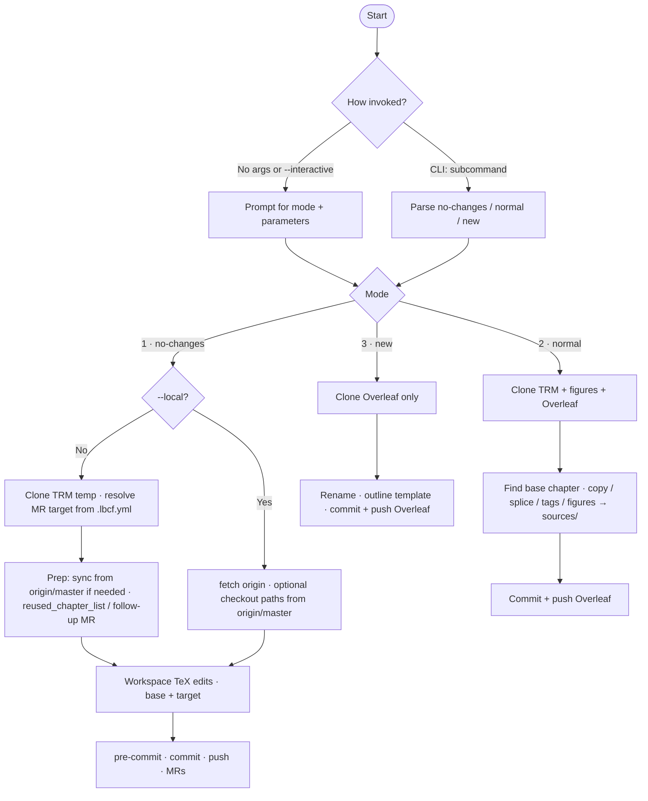
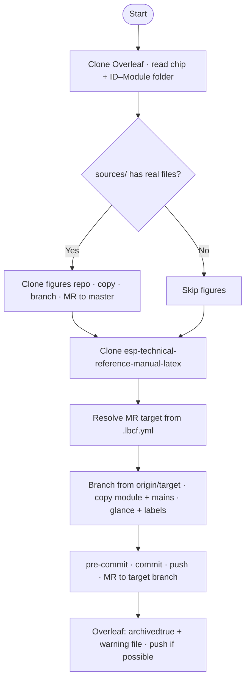
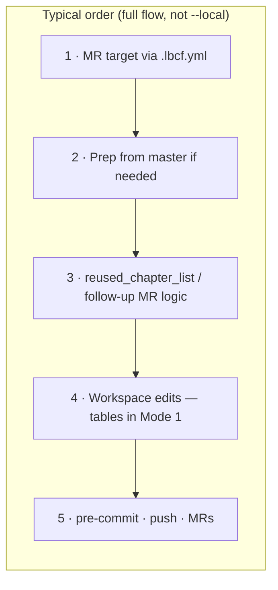

# TRM Automation Tools (`tools/trm_automation_tools`)

Python helpers for **setting up** TRM chapters (Overleaf / esp-technical-reference-manual-latex) and **publishing** finished chapters from Overleaf to GitLab. For diagram overviews of each script, see **[Flowcharts](#flowcharts)**.

| Script | Purpose |
|--------|---------|
| [`set_up_trm_chapters.py`](set_up_trm_chapters.py) | Interactive or CLI: no-changes, normal, and new chapter flows |
| [`publish_trm_chapters.py`](publish_trm_chapters.py) | Clone Overleaf → figures repo + esp-technical-reference-manual-latex, MRs, archive hints |

---

## Prerequisites

### `environment.py` (repo root)

Create `environment.py` in the **esp-technical-reference-manual-latex repo root** with the variables you need for the operations you run.

```python
# Overleaf
OVERLEAF_TOKEN = "your_overleaf_git_token"

# GitLab
GITLAB_URL = "https://gitlab.example.com"  # instance root (scheme + host + port only; no project path)
GITLAB_TOKEN = "your_personal_gitlab_token"   # Requires "api" scope
```

### Python dependencies

```bash
pip install GitPython python-gitlab pre-commit requests PyYAML
```

Using a venv is recommended:

```bash
python3 -m venv venv
source venv/bin/activate   # macOS/Linux
pip install GitPython python-gitlab pre-commit requests PyYAML
```

---

# Set up TRM chapters

Automate setting up chapters in three modes:

1. **No-changes** — reference a base project’s chapter in esp-technical-reference-manual-latex (no content edits).
2. **Normal** — copy a base chapter from esp-technical-reference-manual-latex into an Overleaf repo.
3. **New** — set up from the outline template in Overleaf.

## How to run

### Interactive (recommended)

From the repo root:

```bash
python tools/trm_automation_tools/set_up_trm_chapters.py
```

Or:

```bash
python tools/trm_automation_tools/set_up_trm_chapters.py --interactive
```

### CLI (subcommands)

```bash
# Mode 1: No-changes chapter
python tools/trm_automation_tools/set_up_trm_chapters.py no-changes <base_project> <target_project> <module> [jira_ticket_id] [--local]

# Mode 2: Normal chapter (from base)
python tools/trm_automation_tools/set_up_trm_chapters.py normal <overleaf_id> <base_project> <target_id_module> <EN|CN> \
  [--module-pm NAME] [--writer NAME]

# Mode 3: New chapter (from template)
python tools/trm_automation_tools/set_up_trm_chapters.py new <overleaf_id> <target_id_module> <EN|CN> \
  [--module-pm NAME] [--writer NAME]
```

---

## Mode 1: No-changes chapter

Set up a target project so it references a base project’s chapter in esp-technical-reference-manual-latex. The tool updates mains, glance, temp labels, and **extends `\tagged` / `\untagged` / `\iftagged` lists in the shared source tree** so the reused chapter applies to the target chip.

### Arguments

| Argument | Description | Example |
|----------|-------------|---------|
| `base_project` | Project whose chapter is reused | `ESP32-P4` |
| `target_project` | Project that will reference that chapter | `ESP32-S31` |
| `module` | **Module** alias; case-insensitive match | `ECDSA` |
| `jira_ticket_id` | Optional; Jira key for the MR description (same idea as `publish_trm_chapters.py`) | `TRMC5-12345` |

### Options

| Flag | Description |
|------|-------------|
| `--local` | Only change the local working tree — no clone, push, or MR (any `jira_ticket_id` is ignored) |

### Examples

**Full flow** (clone → branch → modify → pre-commit → commit → push → MR):

```bash
python3 tools/trm_automation_tools/set_up_trm_chapters.py no-changes ESP32-P4 ESP32-S31 ECDSA
# With Jira key in the MR description (optional 4th argument):
python3 tools/trm_automation_tools/set_up_trm_chapters.py no-changes ESP32-P4 ESP32-S31 ECDSA TRMC5-12345
```

**Local only**:

```bash
python3 tools/trm_automation_tools/set_up_trm_chapters.py no-changes ESP32-P4 ESP32-S31 ECDSA --local
```

If you pass both a Jira key and `--local`, put the ticket **before** `--local` (e.g. `… ECDSA TRMC5-12345 --local`); `… ECDSA --local TRMC5-12345` is invalid.

### What happens

**Full flow (no `--local`)** — order of operations:

1. **Resolve the GitLab MR target branch** from the repo-root `.lbcf.yml`: find the **English** TRM row whose `chip_series` matches the **target** chip. Then `visibility_on_website: show` → MR target **`master`**; `hide` → **`release/v0.1`**; no matching English row → default **`release/v0.1`**. The working branch is created from **`origin/<that target>`** (not always `master`).
2. **Prep the working tree** when needed: sync the reused chapter from `origin/master` and uncomment `% \subfile` / `% \subfileinclude` if the chapter is not yet included on the `release/v0.1` branch.
3. Update `tools/auto_backport/reused_chapter_list.txt` when the MR target is **`master`**. For **internal** targets (`release/v0.1`), a **follow-up MR to `master`** may register paths and sync chapter files — created when needed.
4. **Apply workspace edits** (tables below).
5. Pre-commit (on touched paths), commit, push branch, open GitLab MR(s).

**`--local`:** no clone, push, or MR. It may still **fetch** `origin` and check out reused chapter paths from `origin/master` before the workspace edits if the chapter is missing or not listed on `master`; then you review, commit, and open MRs yourself.

#### Workspace edits

**Base project**

| File | Change |
|------|--------|
| `NN-Alias__EN.tex` / `__CN.tex` | `\def \modulefiles {./NN-Alias}` → `\def \modulefiles {../BaseProject/NN-Alias}` |
| `NN-Alias/**/*.tex` and `NN-Alias__EN.tex` / `__CN.tex` | Where `\tagged` / `\untagged` / `\iftagged` lists match the **base** project name, the **target** project name is appended so conditional content applies to the new chip |

If the base already reuses a chapter via `\subfile` from an upstream project, the script follows that chain.

**Target project**

| File | Change |
|------|--------|
| `*-main__EN.tex` / `*-main__CN.tex` | `\subfileinclude{…}` → `\subfile{../BaseProject/NN-Alias__EN}` (per language) |
| `*-main__EN.tex` / `*-main__CN.tex` | Uncomments `\part` header and description if this is the first published chapter in its part |
| `temp-labels-*.tex` | Removes the temp-label block for `mod:<module>` |
| `glance__*.tex` (or `glance-latest__*`) | Status line → Published / 已发布 |

---

## Mode 2: Normal chapter

Copy an existing chapter from esp-technical-reference-manual-latex into an Overleaf repo.

### Arguments

| Argument | Description | Example |
|----------|-------------|---------|
| `overleaf_id` | Overleaf project ID | hex string from project URL |
| `base_project` | Base folder in esp-technical-reference-manual-latex | `ESP32-C5` |
| `target_id_module` | Target **ID–Module** | `45-I2S` |
| `source_lang` | `EN` or `CN` | `EN` |

### Options

| Flag | Description |
|------|-------------|
| `--module-pm` | Written to `\item Module PM:` in `00-shared/config/readme.tex` |
| `--writer` | Written to `\item Writer:` in the same file |

### Example

```bash
python3 tools/trm_automation_tools/set_up_trm_chapters.py normal abc123456789 ESP32-H4 45-I2S CN \
  --module-pm "Name A" --writer "Name B"
```

### Workflow

1. Clone the esp-technical-reference-manual-latex and figures repo, and the Overleaf project.
2. Find the chapter in the base project (follows `\subfile` chains to upstream projects when needed).
3. In Overleaf:
   - Comment out temporary labels, fill readme contacts (if provided).
   - Copy chapter folder from base (preserves any existing `sources/` folder).
   - Splice `\hypertarget`…`\end{document}` content from base mains into root `.tex` files.
   - Rename placeholder → target ID–Module, fix `\modulefiles`, move non-source-language main into module folder.
4. Resolve `\tagged` / `\untagged` / `\iftagged` macros for the base project — content matching the base project's tag is kept, non-matching content is removed. For ESP32-P4, the script treats `ESP32-P4-latest` as a matching tag, so it retains the latest-version content and prefers documents with the `-latest` suffix. Any remaining `-latest` in `\subfile{}` references is stripped.
5. Copy matching **figure sources** from the figures repo (`<base_project>/…`) into the Overleaf module’s `sources/` when a suitable folder exists (prefers `NN-MODULE-latest` over `NN-MODULE` when both exist).
6. Commit and push to Overleaf.

---

## Mode 3: New chapter

New chapter from the outline template only.

### Arguments

| Argument | Description |
|----------|-------------|
| `overleaf_id` | Overleaf project ID |
| `target_id_module` | Target ID–Module (`NN-Alias`) |
| `source_lang` | `EN` or `CN` |

Optional `--module-pm` and `--writer` as in mode 2.

### Example

```bash
python3 tools/trm_automation_tools/set_up_trm_chapters.py new abc123456789 45-I2S EN
```

### Workflow (summary)

1. Clones Overleaf.
2. Renames placeholder → target id, updates `\modulefiles`, moves non-source main, applies outline template to the source-language main.
3. Commits and pushes to Overleaf.

---

## Set up: troubleshooting

| Issue | What to do |
|-------|------------|
| `environment.py not found` | Add tokens in repo root (not needed for `--local` mode 1) |
| `.lbcf.yml` / document config errors | Full no-changes flow needs a valid `.lbcf.yml` with a `documents` list; fix YAML or chip visibility |
| `Base project directory not found` | Ensure `BaseProject/` exists at repo root |
| `Chapter folder for module … not found` | Need `digit(s)-Module` folder or valid `\subfile` chain |
| `Cannot find \modulefiles` | Fix chapter mains manually if non-standard |
| No module folder in Overleaf | Supported: script infers from root mains; see implementation notes in older docs |
| Outline template missing | Add `00-shared/outline-template-en.tex` / `-cn.tex` (or equivalent names the script finds) |
| readme PM/Writer not updated | Lines must match `\item Module PM:` / `\item Writer:` |
| Temp labels not commented | Label pattern and indentation must match script expectations |
| Pre-commit warnings | Script may continue; fix before merge |

---

# Publish TRM chapters

Automate publishing from Overleaf to GitLab: **figures** repo (if `sources/` has real files), **esp-technical-reference-manual-latex** repo, then partial **Overleaf archive** steps.

## What it does

1. Clones the Overleaf project; reads chip name and chapter folder (`digit(s)-UPPERCASE` ID–Module).
2. **Figures repo** (if `sources/` has real files): clone, copy sources, branch, MR to **`master`** on the figures project.
3. **esp-technical-reference-manual-latex**: clone, then set the **GitLab MR target branch** from `.lbcf.yml` using the chip: find the **English** TRM row with matching `chip_series`; `visibility_on_website: show` → **`master`**; `hide` → **`release/v0.1`**; no English row → **`release/v0.1`**. Create a branch from **`origin/<target>`**, copy module + root mains, uncomment `\subfileinclude` / `\globaltrue`, uncomment `\part` header if first chapter in its part, update glance + temp labels, pre-commit, commits, open MR to that target branch.
4. **Overleaf**: uncomment `\archivedtrue`, add `!NO-EDITS-IN-PROJECT!.txt` (links to this repo under `GITLAB_URL`), push if possible.

## How to run

From the repo root:

**Interactive** (prompts for Overleaf id; Jira ticket is optional):

```bash
python tools/trm_automation_tools/publish_trm_chapters.py
```

Same as `-i` / `--interactive`.

**Non-interactive**:

```bash
python tools/trm_automation_tools/publish_trm_chapters.py <overleaf_project_id> [<jira_ticket_id>]
```

- **Overleaf ID** — required; the id in `https://www.overleaf.com/project/<id>`
- **Jira ticket** — optional; included in MR descriptions when provided (e.g. `TRMC5-12345`)

### Expected Overleaf layout

```
overleaf-project/
├── 00-shared/
│   └── chip-spec-settings.sty    # \newcommand\chipname{ESP32-XX}
│       (or preamble-trm-module.sty)
├── 25-ECDSA/                     # Chapter folder: ID–Module, digit(s)-UPPERCASE
│   ├── …
│   └── sources/                  # Optional: .drawio, .odg, …
├── 25-ECDSA__CN.tex
└── 25-ECDSA__EN.tex
```

### After running

Review MRs in GitLab. Before merging esp-technical-reference-manual-latex MR, typical checks:

1. Review pre-commit auto-fixes
2. Adjust custom temp labels if needed
3. Update revision history if required
4. Build locally
5. Check links, e.g. `python tools/check_latex_links/check_latex_links.py …` (see script output)

**Overleaf archiving** still requires manual steps (no public API): remove collaborators except the CI account, then archive the project.

---

## Publish: troubleshooting

| Issue | What to do |
|-------|------------|
| `environment.py not found` | Create file in repo root with all required ids/tokens |
| Invalid / missing `.lbcf.yml` | TRM publish clones the repo and reads `.lbcf.yml`; ensure the file exists and lists the chip’s TRM with `visibility_on_website`; missing EN row defaults MR target to `release/v0.1` |
| `No module folder found` | Folder must match `digit(s)-UPPERCASE` at project root |
| `Could not find \chipname` | Fix `chip-spec-settings.sty` or `preamble-trm-module.sty` |
| Pre-commit failures | Script may continue; fix before merge |
| Archive push failed | Retry or finish archive manually in Overleaf |

### Limitation

- **ESP32-P4**: Some trees use a different layout than the expected module-folder pattern; you may need manual steps or script tweaks.

---

## Flowcharts

### `set_up_trm_chapters.py`



### `publish_trm_chapters.py`



### Mode 1 no-changes (full flow) — detail


